# Production-Grade Autonomous Streaming Data & MLOps Platform

## 🛠️ Tech Stack _ Built Entirely on AWS_

# Production-Grade Autonomous Streaming Data & MLOps Platform

## Table of Contents

- [1. Executive Overview](#1-executive-overview)
- [2. System Architecture](#2-system-architecture)
- [3. Data Ingestion Layer](#3-data-ingestion-layer)
  - [3.1 Data Sources](#31-data-sources)
  - [3.2 Producer Architecture](#32-producer-architecture)
  - [3.3 Kafka Topic Design](#33-kafka-topic-design)
  - [3.4 Error Handling & Retry Strategy](#34-error-handling--retry-strategy)
- [4. Bronze Layer - Raw Data Landing Zone](#4-bronze-layer---raw-data-landing-zone)
  - [4.1 Purpose](#41-purpose)
  - [4.2 Storage Design](#42-storage-design)
  - [4.3 Bronze Tables](#43-bronze-tables)
- [5. Silver Layer - Cleansed & Standardized Data](#5-silver-layer---cleansed--standardized-data)
  - [5.1 Purpose & Data Validation](#51-purpose--data-validation)
  - [5.2 Schema Normalization](#52-schema-normalization)
  - [5.3 Deduplication Strategy](#53-deduplication-strategy)
  - [5.4 Lineage Architecture (dbt Directed Acyclic Graph)](#54-lineage-architecture-dbt-directed-acyclic-graph)
  - [5.5 Silver Table Catalog & Schemas](#55-silver-table-catalog--schemas)
- [6. Gold Layer - ML Feature Store](#6-gold-layer---ml-feature-store)
  - [6.1 Purpose & Feature Engineering](#61-purpose--feature-engineering)
  - [6.2 ML Inference, Loop Feedback, and Model Retraining](#62-ml-inference-loop-feedback-and-model-retraining)
  - [6.3 Feature Tables](#63-feature-tables)
    - [1. `FCT_MARKET_ML_FEATURES`](#1-fct_market_ml_features)
    - [2. `FCT_NLP_FEATURE_INPUTS`](#2-fct_nlp_feature_inputs)
    - [3. `FCT_MODEL_PREDICTIONS`](#3-fct_model_predictions)

---

# 1. Executive Overview

This platform acts as a fully automated, decoupled backend infrastructure designed to ingest high-throughput, real-time financial market ticks and corporate news datasets. The architecture dynamically cleanses raw streaming data through a structured Medallion topology, executes automated cloud machine learning inference pipelines, and runs a closed-loop evaluation system to continuously compile labeled feature datasets optimized for autonomous model retraining. By prioritizing high availability and strict system decoupling, the infrastructure isolates streaming volatility from episodic analytical compute workloads.

# 2. System Architecture

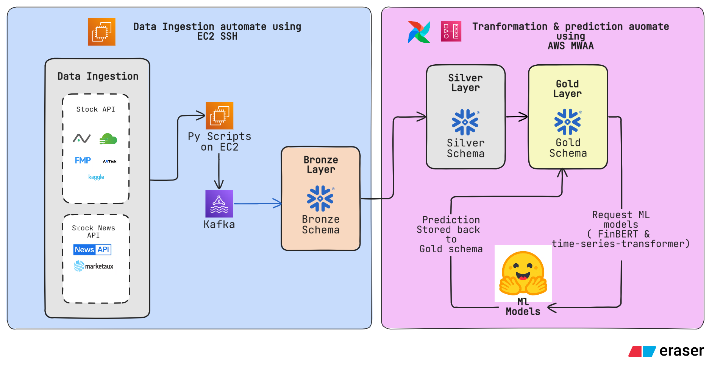

### Architectural Flow Breakdown:

1. **Data Ingestion Layer (Continuous):** Multi-source financial market protocols (Alpaca, Finnhub, AllTick) and qualitative sentiment drivers (NewsAPI, Marketaux) are captured continuously via an active polling worker.
2. **Streaming Transport Layer (Low-Latency):** Raw unstructured payloads are instantly serialized and streamed through an Apache Kafka cluster (Amazon MSK) to safeguard against down-stream data loss and buffer high-volume market activity.
3. **Structured Warehouse Storage (Snowflake Medallion):** Streams are automatically sinked into a raw landing zone (**Bronze**), integrated and type-cast into unified transaction histories via scheduled dbt transformations (**Silver**), and synthesized into optimized ML feature tables (**Gold**).
4. **Orchestration & MLOps Compute (AWS MWAA & EC2):** Managed Apache Airflow coordinates secure, episodic SSH compute sessions to run Hugging Face predictive inference and instantly execute a ground-truth evaluator script, writing performance drift analytics back to the core data vault.

# 3. Data Ingestion Layer

To guarantee structural integrity and type safety across the ingestion pipeline, the system enforces a strict validation layer using `Pydantic baseline` schemas defined in `models.py`. Every raw JSON payload streaming from upstream market data feeds—including real-time trade ticks from Finnhub, daily aggregates from Alpha Vantage, order books from AllTick, and sentiment streams from NewsAPI and MarketAux—is immediately parsed and validated against its corresponding BaseModel profile. This architectural bottleneck ensures that malformed API responses are caught at the boundary, fields utilizing custom external aliases are safely mapped into native attributes, and only guaranteed, clean structures are serialized and broadcasted down the line.

### 3.1 Data Sources

The pipeline ingests raw financial market data and news from five distinct external APIs:

- **Finnhub:** Ingests live stock trades via a continuous WebSocket connection. The producer subscribes to major tech symbols including GOOGL, MSFT, AMZN, and NVDA.

- **AllTick:** Provides live streaming crypto and forex tick data via WebSockets. The system specifically tracks symbols such as BTCUSDT, ETHUSDT, and EURUSD.

- **AlphaVantage:** Used for fetching 100-day daily historical chart data for stocks. It queries the `TIME_SERIES_DAILY` REST API endpoint for GOOGL, MSFT, AMZN, and NVDA.

- **MarketAux:** Polls multi-asset news articles published within the last 7 days via REST API. The service queries every 5 minutes (300 seconds) for entities like GOOGL, MSFT, AMZN, NVDA, CC:BTC, and CC:ETH.

- **NewsAPI:** Fetches multi-asset news coverage published over the past week via REST API. It polls every 5 minutes for keywords including Google, Microsoft, Amazon, Nvidia, Bitcoin, and Ethereum.

### 3.2 Producer Architecture

The data ingestion layer is modular, utilizing independent Python scripts for each data source located within the `scripts/` directory.

- **Central Orchestration:** A master script, `run_all.py`, launches and monitors all producers alongside the Snowflake consumer bridge using Python's `subprocess.Popen`. This allows all 6 channels to stream live in the background simultaneously.

- **Secure Configuration:** Sensitive credentials, such as API keys and the Snowflake account details, are loaded from a `.env` file via the `python-dotenv` library.

- **Data Validation:** Before raw JSON data is produced to Kafka, it is strongly typed and validated using Pydantic models (e.g., `FinnhubResponse`, `MarketAuxResponse`) imported from `models.py`.

- **Kafka Publishing:** The validated Pydantic models are serialized back to JSON and published to the AWS MSK cluster using the `confluent_kafka.Producer`.

### 3.3 Kafka Topic Design

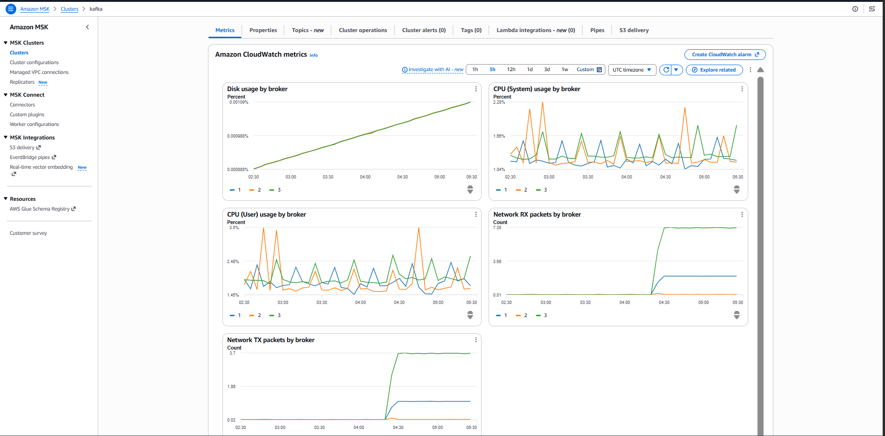

The data is streamed through an Amazon MSK (Managed Apache Kafka) cluster. Monitoring through AWS CloudWatch indicates the cluster is distributed across three brokers, tracking standard metrics like Disk usage, CPU usage, and Network RX/TX.

Each data producer maps its output to a distinct Kafka topic, which a centralized consumer (`snowflake_consumer.py`) maps directly to target tables in Snowflake's Bronze layer:

- `raw_finnhub_ticks` flows into `bronze_finnhub_ticks`.

- `raw_alltick_ticks` flows into `bronze_alltick_ticks`.

- `raw_marketaux_news` flows into `bronze_marketaux_news`.

- `raw_newsapi_news` flows into `bronze_newsapi_news`.

- `raw_alphavantage_candles` flows into `bronze_alphavantage_candles`.

The consumer bridge operates under the group ID `snowflake-bridge-group` and pulls stringified JSON payloads directly into Snowflake's `VARIANT` column utilizing the `PARSE_JSON()` function.

### 3.4 Error Handling & Retry Strategy

Resilience is built directly into the individual producer scripts to handle API limits, structural anomalies, and safe pipeline shutdowns:

- **WebSocket Keep-Alives & Filtering:** The AllTick producer runs a background daemon thread that sends a ping (cmd_id 22000) every 10 seconds to keep the socket alive. Furthermore, it uses a resilience guard to drop extraneous messages like heartbeats or subscription receipts, strictly processing streaming quote pushes (cmd_id 22999).

- **Rate Limit Compliance:** The AlphaVantage producer enforces a 15-second `time.sleep()` delay between ticker requests to avoid breaching the free tier limit of 5 requests per minute.

- **API Anomaly Detection:** Both REST API producers (MarketAux and NewsAPI) evaluate response dictionaries for structural error blocks (such as checking for "error", "message", or "status" == "error") to gracefully bypass failures without crashing the application. AlphaVantage similarly checks for "Note", "Information", or "Error Message" keys.

- **Clean Orchestrator Terminations:** The `run_all.py` manager script wraps the execution loop in a `try/except KeyboardInterrupt` block. Upon an emergency stop (CTRL+C), it cleanly iterates through and terminates all active child subprocesses to achieve a clean system exit.

# 4. Bronze Layer - Raw Data Landing Zone

### 4.1 Purpose

The primary objective of the Bronze Layer is to act as an immutable, append-only landing zone that captures raw streaming data exactly as it arrives from upstream producers. By decoupling ingestion from complex analytical transformations, this layer serves as the single source of truth for replayability, auditing, and disaster recovery. Retaining the complete historical record of unmodified payloads guarantees that downstream pipelines can be re-run or re-architected at any time without data loss.

### 4.2 Storage Design

The storage architecture is hosted entirely within **Snowflake** under the centralized database **`ALPHA_FINANCIAL_DB`**. Within this database, a dedicated schema handles the raw isolation boundary.

To maximize ingestion stability and accommodate frequent upstream API schema modifications without pipeline downtime, the infrastructure completely avoids rigid, multi-column relational tables. Instead, it leverages a specialized schema design using Snowflake’s native **`VARIANT`** data type for semi-structured data:

- **`RECORD_CONTENT` (`VARIANT`):** A single, high-performance semi-structured column that stores the raw, untransformed JSON payload directly as mapped by the upstream Kafka Sink connectors.
- **`RECORD_METADATA` (`VARIANT`):** A system auditing column that isolates ingestion stream metadata (such as Kafka offsets, source partition IDs, and ingestion timestamps) to maintain a chronological paper trail of every incoming event.

### 4.3 Bronze Tables

The layer comprises five distinct tables tailored to individual data feeds, capturing both real-time order books, historical candle data, and unstructured financial sentiment:

#### 1. `BRONZE_ALLTICK_TICKS`

Captures high-frequency, real-time depth-of-market data, including order book bids and asks array structures.
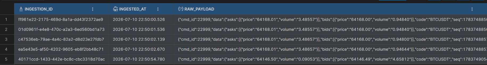

#### 2. `BRONZE_ALPHAVANTAGE_CANDLES`

Stores Daily time-series market aggregates containing opening, high, low, closing, and volume metrics under their respective API aliases.
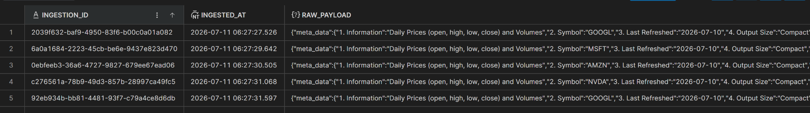

#### 3. `BRONZE_FINNHUB_TICKS`

Ingests rapid, real-time price tick objects containing trade conditions, velocity, volume, and exact trade timestamps.
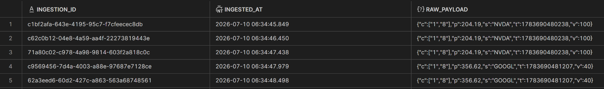

#### 4. `BRONZE_MARKETAUX_NEWS`

Lands structured external news articles alongside nested entity tracking metadata and targeted entity sentiment scores.
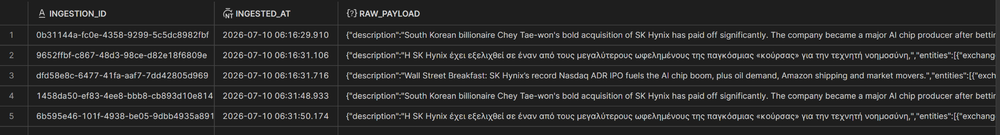

#### 5. `BRONZE_NEWSAPI_NEWS`

Maintains unstructured global news headlines, complete author logs, source attribution records, and raw article text content arrays.

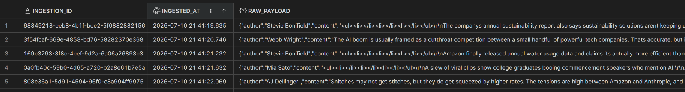

# 5. Silver Layer - Cleansed & Standardized Data

### 5.1 Purpose & Data Validation

The Silver Layer serves as the structural checkpoint of the data platform, transforming raw, multi-nested JSON structures into highly structured, schema-validated, and clean relationally modeled tables. While the Bronze layer prioritizes ingestion speed and fault-tolerance by landing payloads verbatim, the Silver Layer guarantees data quality, downstream type safety, and analytical integrity.

Data validation is enforced systematically through dbt compilation parameters and explicit SQL filter rules:

- **Infrastructure Guardrails:** Drops structural payloads that do not contain valid payload attributes (e.g., stripping out connection heartbeats by validating specific internal command codes, such as filtering for `cmd_id = 22999`, or ensuring core operational tickers are present).

- **Completeness Enforcement:** Implements assertions to ensure high-priority keys (such as unique identifiers, source names, and titles) are explicitly populated (`IS NOT NULL`) before propagating downstream.

- **Temporal Calibration:** Validates structural strings and nested metadata to ensure timestamps comply with unified chronological fields, converting multi-digit UNIX timestamps and ISO strings into clean zone-aware temporal attributes.

### 5.2 Schema Normalization

Raw payloads contain a diverse mix of naming conventions, casing strategies, nested dictionaries, and nested data arrays. Normalization translates this chaos into a unified format by moving through two specialized architectural sub-folders within the dbt directory structure:

#### 1. `staging/` Folder → The Bronze-to-Silver Gatekeeper

This folder contains staging (`stg_`) models that act as structural interfaces directly above the raw Snowflake `VARIANT` tables. Models here query the `RECORD_CONTENT` variant using Snowflake's colon path syntax (e.g., `raw_payload:s::string`) to extract values from deep JSON trees. Staging components are responsible for:

- Extracting deeply nested nodes and aliased property strings (such as Alpha Vantage's custom numbered object attributes like `"meta_data"."2. Symbol"` or `"time_series"`).

- Casting dynamic string properties into definite relational data types (`float`, `bigint`, `timestamp_tz`, `date`).

- Renaming source-specific aliases into a single uniform enterprise naming vocabulary (e.g., mapping fields like `s`, `code`, or `Symbol` down to a standard structural identifier).

#### 2. `intermediate/` Folder → The Core Silver Layer

This folder houses the intermediate (`int_`) models that blend the distinct upstream staging models. The primary objective is to group and unify related streams. For instance, `int_unified_market_ticks` blends real-time fields from separate channels into a standardized transactional schema, while `int_unified_news` stacks news items from disparate publishers into a common schema.

### 5.3 Deduplication Strategy

Due to the decoupled nature of high-throughput streaming systems, network retries, and scheduled polling intervals, duplicate data elements are naturally introduced at the landing edge. The Silver layer implements an algorithmic deduplication checkpoint across all staging pipelines using Snowflake’s analytical `window` capabilities.

Every staging script utilizes a strict `QUALIFY` clause executing a `ROW_NUMBER()` sorting window:

- **Partitioning Granularity:** Data is partitioned by its operational unique identifier or business key (e.g., `stock_ticker` combined with `sequence_id`, `article_uuid` paired with `entity_ticker`, or standard timestamp records).

- **Chronological Sorting:** The rows are ordered dynamically by the target event's occurrence time or extraction boundary (`ORDER BY event_timestamp DESC` or `api_refreshed_at DESC`).

- **Filter Condition:** The system selects only the true state maximum (`= 1`), discarding duplicate messages and out-of-order data frames from the execution buffer.

#### 5.4 Lineage Architecture (dbt Directed Acyclic Graph)

The following Directed Acyclic Graph (DAG) represents the systemic data lineage, mapping out dependencies from raw Snowflake landing zones, through the specialized staging and intermediate layers, and down into final analytics-ready tables.

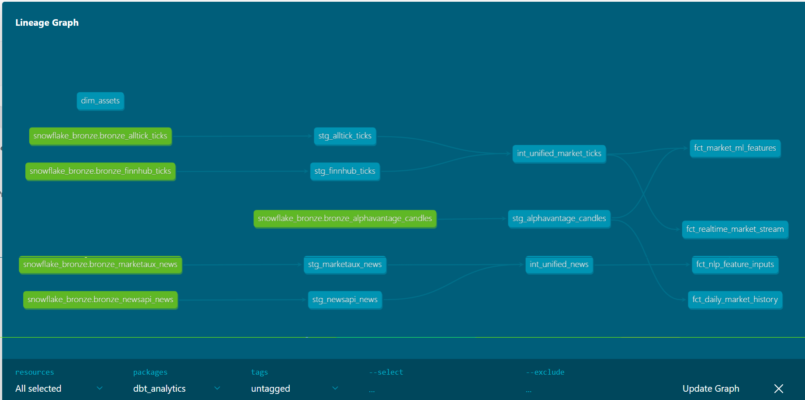

### 5.5 Silver Table Catalog & Schemas

#### 1. `DIM_ASSETS`

A deterministic dimension table housing static tracking profiles, risk categorization parameters, and thematic metadata for global investment assets handled across the ecosystem.

- **Primary Key:** `ASSET_KEY` (`MD5` hash of the asset ticker symbol).

- **Key Fields:** `ASSET_TICKER`, `ASSET_NAME`, `ASSET_CLASS`, `SECTOR_THEME`, `TRADING_HOURS`, `RISK_PROFILE`, `CREATED_AT`.

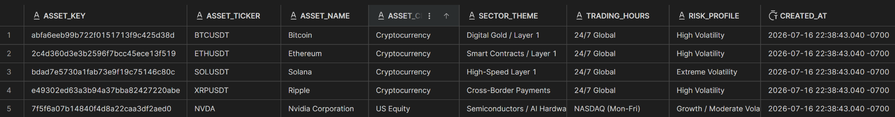

##### 2. `FCT_DAILY_MARKET_HISTORY`

Stores historical end-of-day market candle positions enriched with analytical price range metrics for long-term historical variance calculation.

- **Keys:** `ASSET_KEY` (FK), `STOCK_TICKER`, `CANDLE_DATE`.

- **Key Fields:** `OPEN_PRICE`, `HIGH_PRICE`, `LOW_PRICE`, `CLOSE_PRICE`, `TRADING_VOLUME`, `DAILY_PRICE_RANGE`, `API_REFRESHED_AT`.

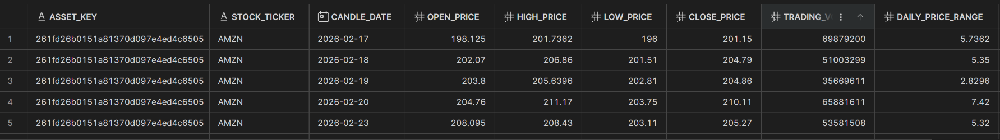

#### 3. `FCT_MARKET_ML_FEATURES`

Integrates real-time trades with historical baseline windows to output live percentage deviations against moving averages, serving as an input feature for ML models.

- **Keys:** `ASSET_KEY` (FK), `STOCK_TICKER`, `EVENT_TIMESTAMP`.

- **Key Fields:** `LIVE_PRICE`, `LIVE_VOLUME`, `BASELINE_CLOSE`, `SMA_20_BASELINE`, `ROLLING_VOLATILITY`, `PRICE_DEVIATION_PCT`, `DW_INSERTED_AT`.
  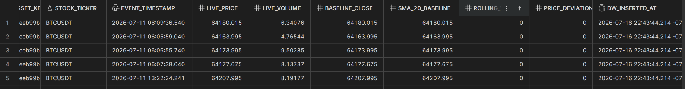

#### 4. `FCT_MODEL_PREDICTIONS`

_Documentation under development._ This table captures the inference metrics, confidence levels, and target directional outputs from deployed machine learning model task
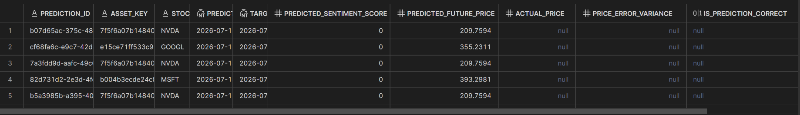

#### 5. `FCT_NLP_FEATURE_INPUTS`

Unifies textual items into filtered, clean payloads ready for FinBERT sentiment evaluation pipelines.

- **Keys:** `ASSET_KEY` (FK), `NEWS_ID`, `ASSET_TICKER`.

- **Key Fields:** `NLP_TEXT_PAYLOAD`, `BASELINE_SENTIMENT`, `NEWS_SOURCE`, `PUBLISHED_TIMESTAMP`, `DW_INSERTED_AT`.
  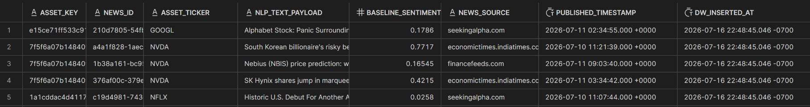

#### 6. `FCT_REALTIME_MARKET_STREAM`

A high-throughput table providing direct visibility into cleansed stream data for immediate consumption by downstream consumers.

- **Keys:** `ASSET_KEY` (FK), `STOCK_TICKER`, `EVENT_TIMESTAMP` .
- **Key Fields:** `TRADE_PRICE`, `TRADE_VOLUME`, `PRICE_SOURCE`, `DW_INSERTED_AT` .
  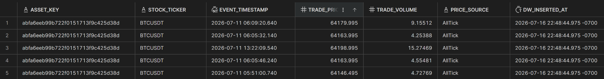

#### 7. `INT_UNIFIED_MARKET_TICKS`

_Documentation under development._ An intermediate entity that unifies high-frequency trade records from all active ticking adapters.
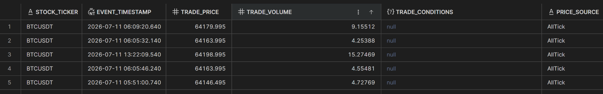

#### 8. `INT_UNIFIED_NEWS`

_Documentation under development._ An intermediate aggregation component stacking unstructured article details, author metadata, and publisher arrays from multiple tracking APIs.
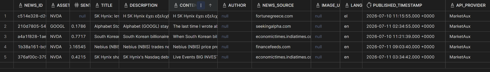

# 6. Gold Layer - ML Feature Store

### 6.1 Purpose & Feature Engineering

The Gold Layer acts as the specialized, analytics-ready tier that houses high-value feature matrices optimized for machine learning models and MLOps evaluation script cycles. While the intermediate layer blends individual data feeds, the Gold Layer synthesizes these refined data sets into high-value feature tables, combining quantitative metrics and qualitative indicators.

The primary business objective of this layer is to prepare and provide access to features that capture market conditions instantly. This allows external predictive scripts to handle the volatility of financial markets. The transformations inside the dbt `marts/` folder perform deterministic feature engineering directly inside Snowflake:

- **Quantitative Signal Synthesis (`FCT_MARKET_ML_FEATURES`):** Blends real-time transactional streams (`int_unified_market_ticks`) against static historical market indicators (`stg_alphavantage_candles`). It calculates historical 20-day price volatility via standard deviation windows and establishes a 20-day Simple Moving Average (SMA) baseline. An engineered feature calculating the real-time percentage deviation from the moving average baseline (`PRICE_DEVIATION_PCT`) is evaluated inline to measure sudden price extensions.

- **Qualitative Sentiment Synthesis (`FCT_NLP_FEATURE_INPUTS`):** Standardizes news metadata from English news networks, filtering out unclassified assets. It concatenates the title and text content body into a single, clean payload (`NLP_TEXT_PAYLOAD`) designed for Natural Language Processing embeddings.

### 6.2 ML Inference, Loop Feedback, and Model Retraining

The Gold Layer serves as the direct data launchpad for automated MLOps inference routines via an external Python orchestration script. This script acts as an interface between Snowflake feature layers and deep learning architectures:

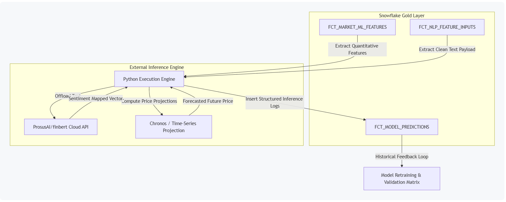

1. **Feature Extraction:** The execution script fetches quantitative asset variations from `FCT_MARKET_ML_FEATURES` and matching text records from `FCT_NLP_FEATURE_INPUTS`.

2. **Hugging Face Cloud Inference:** The text payload is dispatched via cloud infrastructure to the GPU-accelerated **`ProsusAI/finbert`** model, which assigns a normalized sentiment score between `-1.0` (strongly negative) and `1.0` (strongly positive).

3. **Time-Series Forecasting:** The system incorporates a time-series forecast simulating a **`huggingface/time-series-transformer`** or Chronos trajectory, projecting values 5 minutes into the future based on `live_price`, `price_deviation_pct`, and `rolling_volatility` flags.

4. **Feedback Loop & MLOps Retraining:** The resulting predictions, tracking numbers, and target timestamp windows are appended back into **`ALPHA_FINANCIAL_DB.SILVER.FCT_MODEL_PREDICTIONS`**. Because the financial landscape changes gradually over time, this table provides an immutable history of predictions. MLOps validation pipelines query this table alongside actual realized prices to evaluate historical model accuracy, compute performance drift, and automatically trigger retraining jobs to ensure the models adapt to changing market conditions.

#### 6.3 Feature Tables

##### 1. `FCT_MARKET_ML_FEATURES`

The quantitative feature catalog that acts as the primary analytical input matrix for numerical time-series projections.

- **Keys & Dimensions:** `ASSET_KEY` (FK to asset mapping table), `STOCK_TICKER`, `EVENT_TIMESTAMP`.

- **Engineered Vectors:** `LIVE_PRICE`, `SMA_20_BASELINE`, `ROLLING_VOLATILITY`, `PRICE_DEVIATION_PCT`.

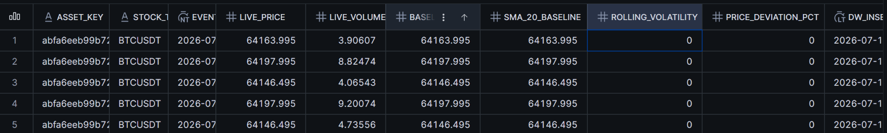

##### 2. `FCT_NLP_FEATURE_INPUTS`

The qualitative textual storehousing system engineered to process string payloads into deep sentiment vectors.

- **Keys & Dimensions:** `ASSET_KEY` (FK), `NEWS_ID`, `ASSET_TICKER`, `PUBLISHED_TIMESTAMP`.

- **Engineered Vectors:** `NLP_TEXT_PAYLOAD` (Concatenated text array), `BASELINE_SENTIMENT`.

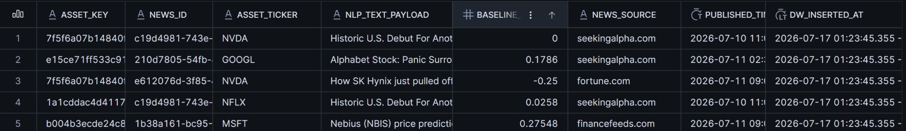

##### 3. `FCT_MODEL_PREDICTIONS`

The final model prediction table tracking historical inference runs, confidence metrics, and targeted price windows for continuous model retraining.

- **Keys & Dimensions:** `PREDICTION_ID` (Primary Key via UUID), `ASSET_KEY` (FK), `STOCK_TICKER`.

- **Inference Outputs:** `PREDICTED_AT`, `TARGET_WINDOW`, `PREDICTED_SENTIMENT_SCORE`, `PREDICTED_FUTURE_PRICE`.

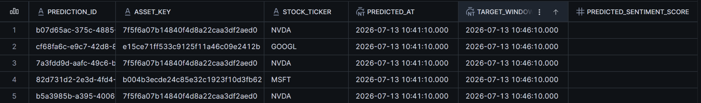

### 7. Full E2E Automation & Orchestration Layer

#### 7.1 Automated Workflow Architecture

To support continuous feature updates and handle rapid market changes, the platform relies on automated cloud orchestration driven by **Apache Airflow** hosted via Amazon Managed Workflows for Apache Airflow (MWAA). The entire workflow runs automatically on a strict **5-minute cadence** (`schedule=timedelta(minutes=5)`), eliminating manual operation and keeping feature store matrices constantly fresh.

The architecture untethers high-compute pipeline execution from the orchestrator by leveraging secure, non-interactive **SSH Tunnels (`SSHOperator`)** connected to a dedicated **Amazon EC2 compute node**. The orchestrator functions strictly as an engine driver, issuing remote execution commands that trigger native, localized shell environments on the EC2 host to manage resources efficiently. Data ingestion lands raw payloads directly into the Snowflake Bronze schema, after which the Airflow pipeline takes over to manage transformations, inference execution, and model performance scoring in a linear sequence.

## 

### 7.2 Linear Execution Pipeline Steps

The automation pipeline runs through three consecutive tasks linked together in a linear execution chain (`run_dbt_transformations >> execute_ml_inference >> evaluate_ground_truth`):

1. **`run_dbt_transformations` (dbt Processing Node):** Connects to the EC2 compute instance via `ec2_compute_node` SSH parameters, navigates to the core repository, and runs `dbt run`. This task pulls the raw JSON variant entries from the Bronze landing area, normalizes them in staging, and updates the Gold ML feature tables (`FCT_MARKET_ML_FEATURES` and `FCT_NLP_FEATURE_INPUTS`) inside Snowflake.

2. **`execute_ml_inference` (Hugging Face Inference Launchpad):** Triggers the execution script `ml_inference_engine.py` on the EC2 host using the environment's isolated python virtual binary. The process reads the freshly calculated feature sets from the Gold Layer, pushes text inputs out to remote Hugging Face GPU hubs (`ProsusAI/finbert`), runs local quantitative price calculations, and records the predictions back into Snowflake.

3. **`evaluate_ground_truth` (Closed Window Evaluation Engine):** Executes `ground_truth_evaluator.py` to process closed prediction windows. It queries historical entries inside `FCT_MODEL_PREDICTIONS` that match or have passed the target validation time stamp, matches them with actual realized stream metrics (`FCT_REALTIME_MARKET_STREAM`), evaluates accuracy metrics using a 1% error threshold, and saves the output data. This structure feeds the model retraining pipeline to prevent accuracy decay over time.

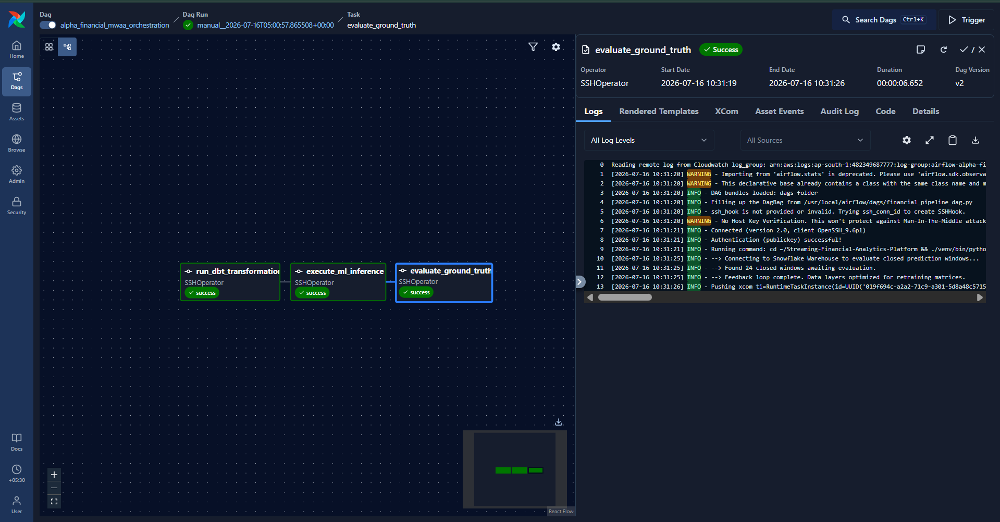

### 7.3 Infrastructure Access & Non-Interactive SSH Operations

For security and performance, the system establishes programmatic SSH connections using automated key validation files (`.env`) to authorize access without interactive prompt blockers. Every task explicitly sources its context configuration directly inside the working project paths to prevent pipeline issues.

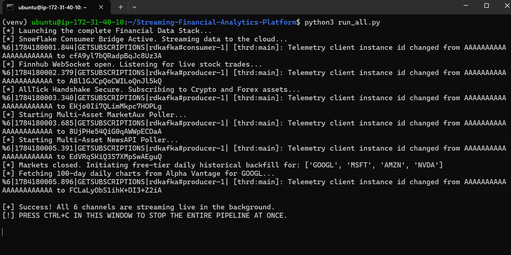
